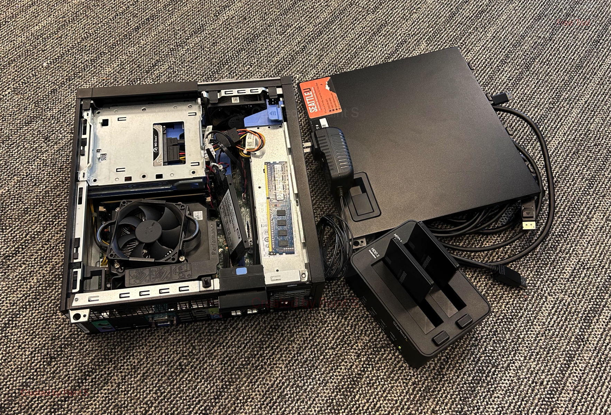

# Homebrew Dropbox file storage.

Welcome to Homebrew Dropbox, an innovative endeavor born out of the desire to create a cost-effective and environmentally conscious cloud storage solution. Leveraging recycled IT components and university resources, I embarked on a mission to craft a personal cloud storage platform that would rival commercial offerings. With Linux as the foundation and a blend of Node.js and React, Homebrew Dropbox emerged as a testament to ingenuity and resourcefulness.

At its core, Homebrew Dropbox aimed to provide seamless file storage and management for myself and my peers. By repurposing discarded hard drives, CPUs, and RAM, I constructed a server that served as the backbone of our storage infrastructure. Through the magic of Node.js, this server became the heart of our digital sanctuary, offering a secure haven for our files and folders.

One of the project's defining features was its negligible operational cost. By harnessing the electricity and network resources available at my university, Homebrew Dropbox operated at virtually zero expense. This not only made it financially sustainable but also underscored its eco-friendly ethos.

However, every innovation comes with its challenges. Despite its success, concerns arose regarding potential security vulnerabilities inherent in the project's architecture. While Homebrew Dropbox showcased the power of DIY solutions, security remained paramount. Consequently, I made the difficult decision to discontinue the project, prioritizing safety and risk mitigation above all else.

Though Homebrew Dropbox may have reached its end, its legacy endures as a symbol of creativity and innovation in the realm of cloud storage. While the journey may have been cut short, the spirit of Homebrew Dropbox lives on, inspiring future explorations and endeavors in the ever-evolving landscape of technology.

